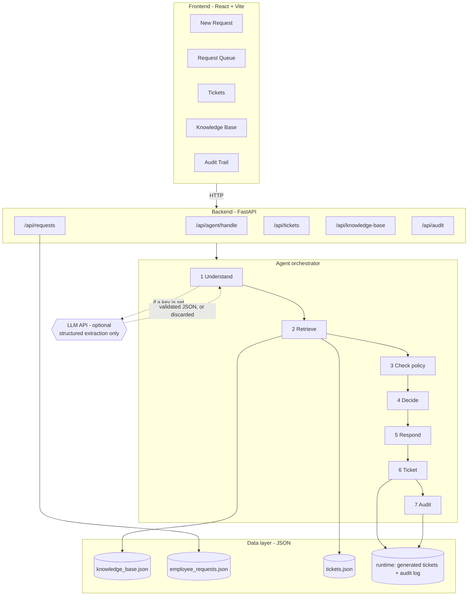
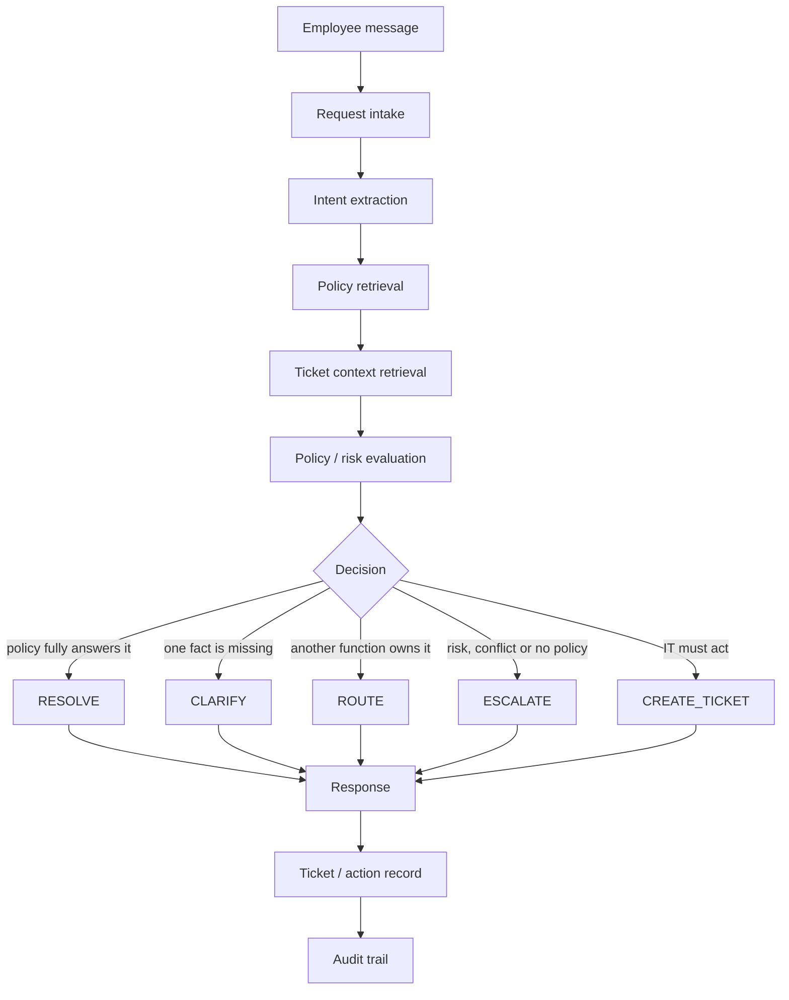
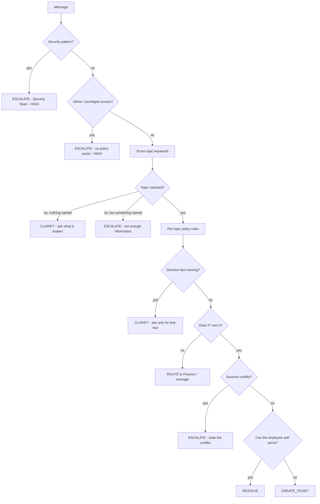

# Architecture

This document explains how the IT Service Agent is put together, in plain
language. If you read only one thing, read section 3 — it explains the single
design decision the whole project rests on.

---

## 1. System architecture



## 2. Process flow



## 3. The central design decision

> **The language model understands. Code decides.**

An LLM asked "what should IT do about this?" will produce a fluent answer
whether or not a policy supports it. That is the failure mode that matters most
in an internal support tool: a confident, well-written, wrong answer about
company policy.

So the work is split:

| Job | Who does it | Why |
| --- | --- | --- |
| Read the message, extract topic + facts | LLM (optional), with rules as fallback | Language understanding is what models are good at |
| Decide RESOLVE / CLARIFY / ROUTE / ESCALATE / CREATE_TICKET | Deterministic Python | The same input must always produce the same decision |
| Produce the policy text shown to the employee | Copied verbatim from the knowledge base | A model cannot invent a rule it is not allowed to write |
| Escalate security incidents | Fixed patterns in code | Too important to depend on model judgement |
| Choose the assigned team | Deterministic Python | Routing is a business rule, not a language task |
| Build the ticket and the audit trail | Deterministic Python | Records must be structurally identical every time |

This is what makes the agent *auditable*. Every field on the screen can be
traced to either a rule in `policy_engine.py` or a line in
`data/knowledge_base.json`.

## 4. Components

### `agent/understanding.py` — Step 1, Understand

Deterministic classification and fact extraction. Always runs, for three reasons:

- it is the **fallback** when the LLM is unavailable;
- it is the **safety override** — security and privileged-access patterns are
  matched here and cannot be reclassified by a model;
- it is **more precise on literal detail** than a model — "3.5 years",
  "6 times", "contractor", "not in the approved catalog" are pulled out by regex.

It classifies into a closed set of 12 topics. Anything it cannot place becomes
`unknown`, which splits into two cases: *vague* (nothing concrete named → ask a
question) and *specific but unsupported* (something named, but no policy covers
it → escalate to a human).

A fact that was not stated stays `None`. The agent never fills a `None` with a
guess.

### `agent/llm.py` — optional understanding assistance

Calls any OpenAI-compatible endpoint and asks for JSON only: a topic from the
fixed list, an intent label, a one-line summary and the facts the employee
stated. Then:

1. the JSON is extracted (code fences and surrounding prose are tolerated);
2. unknown entity keys are dropped;
3. the whole thing is validated with Pydantic.

Any failure — no key, timeout, HTTP error, network error, malformed JSON, an
invented topic — returns `None` with a human-readable reason, and the pipeline
continues on the rules. The failure reason is surfaced in the UI and written to
the audit trail. The application never raises an error because of the LLM.

### `retrieval.py` — Step 2, Retrieve

Two mechanisms, deliberately separate:

1. **BM25 lexical search** over the 11 policies (~40 lines of Python, no
   external service). Produces the match score shown in the UI.
2. **Topic pinning** — a map from topic to the policy IDs that govern it. This
   guarantees the right policy is retrieved even when the employee's words do
   not appear in the policy text.

Search alone is not reliable enough to decide company policy on; pinning alone
would not show the reviewer that retrieval is really happening. Using both gives
a guaranteed-correct citation plus a visible relevance signal.

A supporting (non-pinned) source is only shown if it clears an absolute score
floor **and** 70% of the best score for that query. Without that gate, common
words like "access" or "password" attach irrelevant citations to clean answers.

When a topic has **no** governing policy (privileged access, unknown), retrieval
returns an empty list on purpose — showing a weak keyword match there would
imply the request is covered when it is not.

Ticket context is retrieved separately and every closed ticket is labelled
*"history and precedent only, not policy"*.

### `agent/policy_engine.py` — Steps 3 and 4, Check policy and Decide

Pure Python, no I/O except reading the knowledge base. One function per topic,
each returning a `PolicyOutcome`: the decision, the reason, the risk level, the
team, the next action, the policy points to show, what the employee must do, any
clarifying question, whether a ticket is needed, and any policy conflict.

Every policy sentence it returns is fetched with `store.policy_point(id, index)`
— copied verbatim out of `data/knowledge_base.json`. That single helper is why
the agent cannot paraphrase a rule into something new.

### `agent/responder.py` — Step 5, Respond

Assembles the four things the employee is told — what I understood, what the
policy says, what happens next, what you need to do — from fixed sentence frames
plus the verbatim policy points. The only part an LLM contributes is the
one-line restatement of the employee's own issue, which carries no policy.

### `agent/orchestrator.py` — pipeline order and audit

Owns the order of the seven steps and the audit trail. Holds no policy knowledge
of its own. Each stage appends a timestamped `AuditEvent`; timestamps increment
by a millisecond so the order is always stable.

### `data_store.py` — data access

Loads the three data-pack files as read-only source of truth. Prototype-created
tickets and audit events go to `data/runtime/`, so the two can never be confused.
Corrupt runtime files are ignored rather than crashing the app on startup.

### `models.py` — the contract between stages

Pydantic types for everything: `Topic`, `Decision`, `Entities`, `Understanding`,
`SourceRef`, `PolicyPoint`, `PolicyConflict`, `Ticket`, `AuditEvent`,
`AgentResult`. Because every stage exchanges validated objects rather than free
text, a malformed value is rejected at the boundary instead of flowing into the
answer.

## 5. The structured agent output

One object is returned to the UI and rendered directly:

```jsonc
{
  "interaction_id": "INT-4B1A752F",
  "request_id": "RQ-971A6A",
  "mode": "fallback",              // or "llm"
  "mode_detail": "…why…",
  "understanding": {
    "topic": "laptop_hardware",
    "category": "Hardware",
    "intent": "Laptop reported as failed - replacement enquiry",
    "entities": { "asset_age_years": 3.5, "reported_hardware_failure": true },
    "missing_information": [],
    "risk_level": "medium",
    "classification_source": "rules"
  },
  "decision": "ESCALATE",
  "decision_reason": "Two retrieved sources give conflicting guidance…",
  "priority": "MEDIUM",
  "assigned_team": "Finance + IT Support (joint approval)",
  "next_action": "…",
  "clarifying_question": null,
  "policy_conflict": { "detected": true, "summary": "…", "positions": [...] },
  "response": {
    "understood": "…",
    "policy_says": [{ "source_id": "KB-03", "text": "…verbatim…" }],
    "what_happens_next": "…",
    "your_actions": ["…"],
    "notice": null
  },
  "sources": [{ "id": "KB-03", "relevance": "authoritative", "match_score": 5.1 }],
  "related_tickets": [{ "ticket_id": "TK-1043", "active": true, "note": "…" }],
  "ticket_required": true,
  "ticket": { "ticket_id": "NEW-1001", "...": "..." },
  "audit_events": [ { "stage": "request_received", "...": "..." } ]
}
```

## 6. Decision logic per topic



## 7. Why these technology choices

**BM25 instead of a vector database.** There are 11 policies. An embedding store
would add a dependency, a model download and a failure mode, and it would still
need the topic-pinning safety net to be trustworthy. BM25 in ~40 lines has no
infrastructure, runs instantly, and can be explained in an interview. If the
knowledge base grew to thousands of documents, this is the first thing to swap —
and the interface (`retrieve(query, topic) -> [SourceRef]`) is where it would go.

**JSON files instead of a database.** The data pack is JSON, the prototype is
single-user, and a database would be setup cost with no demo benefit. The
`DataStore` class is the seam a real database would slot into.

**FastAPI + Pydantic.** Validation is not decoration here — it is the mechanism
that rejects malformed LLM output before it can reach a decision.

**Plain CSS instead of Tailwind.** One less build step that can break during a
live demo.

## 8. Failure handling

| Failure | What happens |
| --- | --- |
| No API key | Demo/fallback mode; UI shows the mode badge |
| LLM timeout / HTTP error / network error | Caught, reason recorded, rules take over |
| LLM returns malformed JSON | Extraction tolerates fences; otherwise discarded, rules take over |
| LLM returns an invented topic or entity key | Rejected by Pydantic / dropped; rules take over |
| Empty message | Rejected with HTTP 400/422; the UI blocks it first |
| No policy matches | Agent says it does not have enough information and escalates |
| Corrupt runtime JSON | Ignored on load; the app still starts |
| Backend down | Frontend shows "API unavailable" with the command to start it |
